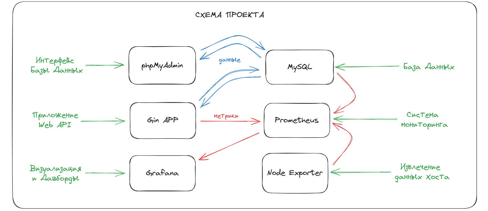
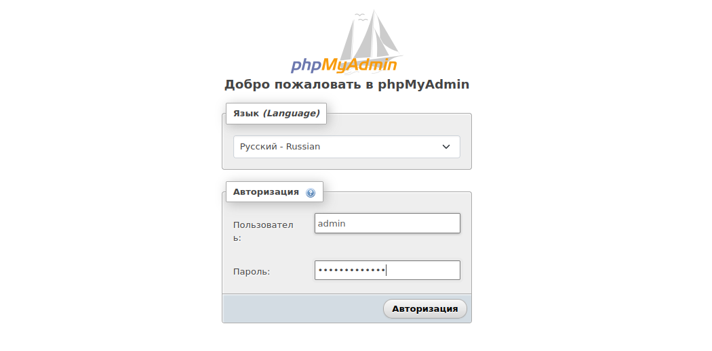
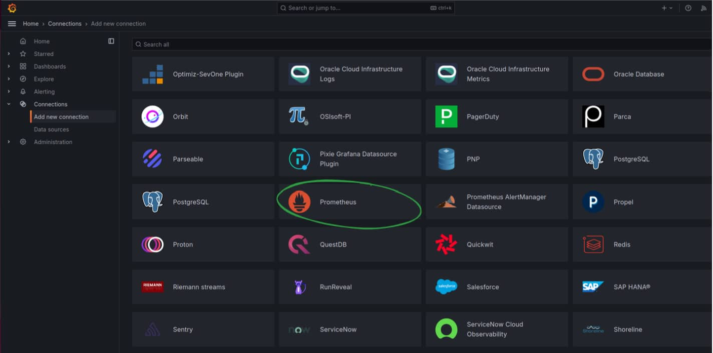
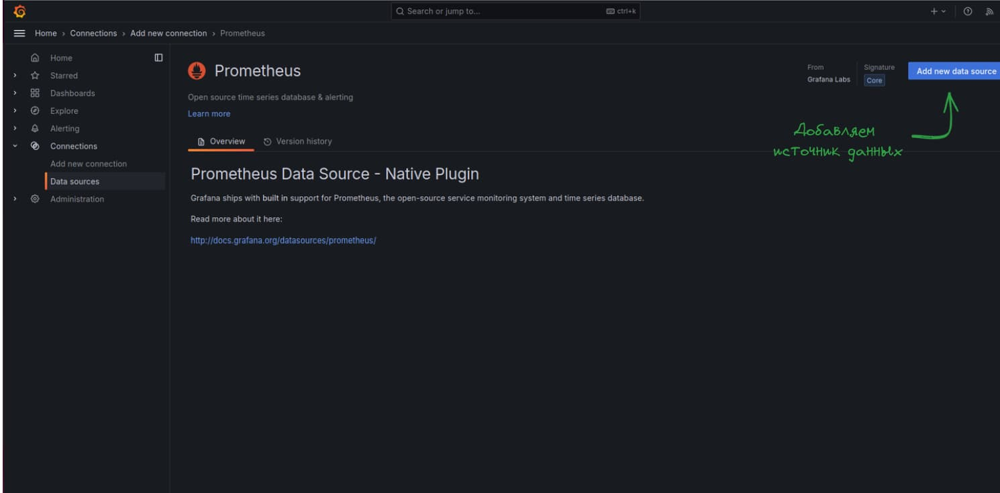
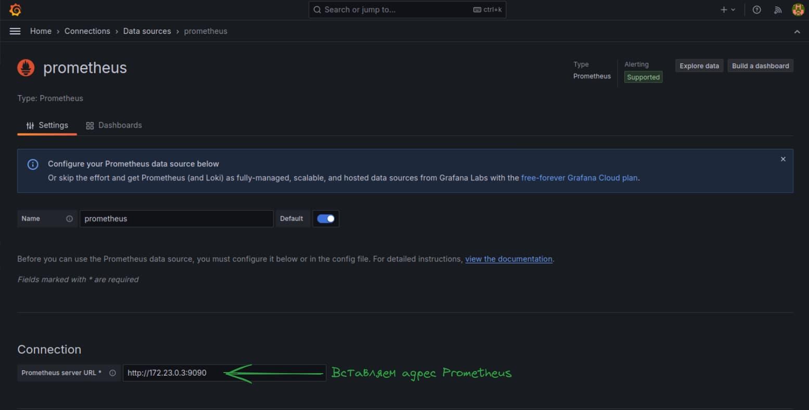

# Go BookStore 


  
&nbsp;&nbsp;&nbsp;&nbsp;&nbsp;&nbsp;&nbsp;&nbsp;&nbsp;&nbsp;&nbsp;&nbsp;&nbsp;&nbsp;&nbsp;&nbsp;&nbsp;&nbsp;&nbsp;&nbsp;&nbsp;&nbsp;&nbsp;&nbsp;&nbsp;&nbsp;&nbsp;&nbsp;&nbsp;&nbsp;&nbsp;&nbsp;&nbsp;&nbsp;&nbsp;&nbsp;&nbsp;&nbsp;&nbsp;&nbsp;&nbsp;&nbsp;&nbsp;&nbsp;&nbsp;&nbsp;&nbsp;&nbsp;&nbsp;&nbsp;&nbsp;&nbsp;&nbsp;&nbsp;&nbsp;&nbsp;&nbsp;&nbsp;&nbsp;&nbsp;&nbsp;&nbsp;&nbsp;


[](https://opensource.org/licenses/MIT)

  

## 📋 Table of Contents

  

1. 🌀 [Описание проекта](#what-is-this)
2. 📈 [Краткая документация API](#api_docs)
3. 💾 [База данных](#database_scheme)
4. 🚀 [Инструкция по установке](#installation)
5. ©️ [License](#license)

  

## <a name="what-is-this"> 🌀 Описание проекта</a>

Go Blog - пример backend-сервисова на основе `Gin Gonic`, Интерфейс API `Swagger`. База данных - `MySQL`. ORM - `GORM`. Мониторинг - `Prometheus`. Метрики хоста - `Node Exporter`. Визуализация - `Grafana`. Сборка - `Docker Compose`.



## <a name="api_docs"> 📈 Краткая документация API</a>

Работа с моделями осуществляется по следующим эндпоинтам:


| HTTP Method  | HTTP request        | Description                                       |
| :----------: | :------------------ | :------------------------------------------------ |
|  [**POST**]  | /users/register     | Регистрация нового пользователя                   |
|  [**POST**]  | /users/login        | Авторизация пользователя про логину и паролю      |
|  [**GET**]   | /api/admin/user     | Извлечение авторизованного пользователя по токену |
|  [**GET**]   | /users/logout       | Разлогиниться                                     |
|  [**POST**]  | /genres             | Создать новый жанр категорию                      |
|  [**GET**]   | /genres             | Извлечь все категории                             |
|  [**POST**]  | /genres/add_book    | Добавить связь между книгой и жанром              |
|  [**POST**]  | /genres/remove_book | Удалить связь между книгой и жанром               |
|  [**GET**]   | /books              | Извлечь все книги                                 |
|  [**POST**]  | /books              | Создать новую книгу (только для админов)          |
|  [**GET**]   | /books/:id          | Извлечь книгу по ID                               |
|  [**PUT**]   | /books/:id          | Обновить книгу (только для админов)               |
| [**DELETE**] | /books/:id          | Удалить книгу (только для админов)                |
|  [**POST**]  | /user/orders        | Создать новый заказ                               |
|  [**GET**]   | /user/orders/:id    | Извлечь заказ по ID (только собственный)          |
|              |                     | Добавить позицию с книгой в заказ                 |
|              |                     | Удалить позицию с книгой из заказа                |


## <a name="database_scheme"> 💾 База данных </a>

База данных содержит 5 моделей:

  - **Пользователь** (User),
  - **Жанр книги** (Genrе),
  - **Книга** (Book),
  - **Заказ** (Order),
  - **Позиция в заказе** (Item)
  

<details>

<summary>ДЕТАЛЬНАЯ СХЕМА БАЗЫ ДАННЫХ</summary>


</details>

  

## <a name="installation"> 🚀 Установка и использование</a>

  

1. ### Подготовка проекта

  

1.1 Клонируете репозиторий

```sh

git clone https://github.com/XanderMoroz/goBookStore.git

```

1.2 В корневой папки создаете файл .env

1.3 Заполняете файл .env по следующему шаблону:

```sh

################################################################################
# APP Config
# Automatically setup app variables
################################################################################
APP_ENV="DEV"
APP_PORT="8082"
SERVER_ADDRESS=""
ACCESS_TOKEN_SECRET="nduenvrvneu8957hhoiif932ejcp92nf9ne7h3p2982jijpkm2[jw[8h"
ACCESS_TOKEN_EXPIRY_HOUR=1
################################################################################
# MYSQL Config
# Automatically create database and user
################################################################################
DB_DRIVER="MYSQL"
MYSQL_ROOT_PASSWORD=rootpwd
MYSQL_DATABASE=my_db
MYSQL_USER=admin
MYSQL_PASSWORD=adminpassword
MYSQL_PORT=3306         
MYSQL_HOST=127.0.0.1            # Без docker             
MYSQL_HOST="mysql"              # С docker
################################################################################
# PHPMYADMIN Config
################################################################################
phpmyadminPort=8090
MYSQL_IP_Address=mysql 

```

2. ### Запуск проекта с Docker compose

2.1 Создаете и запускаете контейнер через терминал:

```sh

sudo docker-compose up --build

```

2.3 Сервисы доступны для эксплуатации:

- Приложение Go `Gin APP`: http://127.0.0.1:8082/                  
- API + Документация `Swagger`: http://127.0.0.1:8082/swagger/index.html  
- Интерфейс для управления БД MySQL `phpMyAdmin`: http://127.0.0.1:8090   
- Система мониторинга (сбора метрик) `Prometheus`: http://127.0.0.1:9090                  
- Извлекает метрики хоста (cpu-, memory-usage) для мониторинга `Node Exporter`: http://127.0.0.1:9100/              
- Аналитическая система (визиализирует данные в виде дашбордов) `Grafana`: http://127.0.0.1:3000                  


3. ### Дополнительные настройки 

<details>
<summary>Как подключить phpMyAdmin к БД? </summary>


1. Заходим в браузер по адресу http://127.0.0.1:8090 и вводим данные из .env

```bash
MYSQL_USER=admin
MYSQL_PASSWORD=adminpassword
```


2. Готово


</details>


<details>
<summary>Как подключить Grafana к Prometheus? </summary>


1. Заходим в браузер по адресу http://127.0.0.1:3000 и вводим данные по умолчанию:

  - Email or username: admin
  - Password: admin


2. После система потребует придумать новый пароль (это необязательно).


3. Мы авторизованы в сервисе Grafana. Добавим новое подключение...


4. Ищем в списке Prometheus и кликаем по нему



5. Теперь его нужно настроить



7. Извлекаем адрес хоста, на котором расположился Prometheus

```bash
sudo docker inspect prometheus | grep IPAddress
```


8. Заполняем Адрес сервера Prometheus данными хоста 



9. Готово

</details>


<details>
<summary>Как сделать авто-генерацию документации Swagger? </summary>

1. Устанавливаете swag

```sh
go get github.com/swaggo/swag/cmd/swag
```

3.2 Устанавливаете GOPATH

```sh
export PATH=$PATH:$(go env GOPATH)/bin
```

3.3 Генерируете новый вариант документации

```bash
swag init
```
</details>


## <a name="license"> ©️ License
